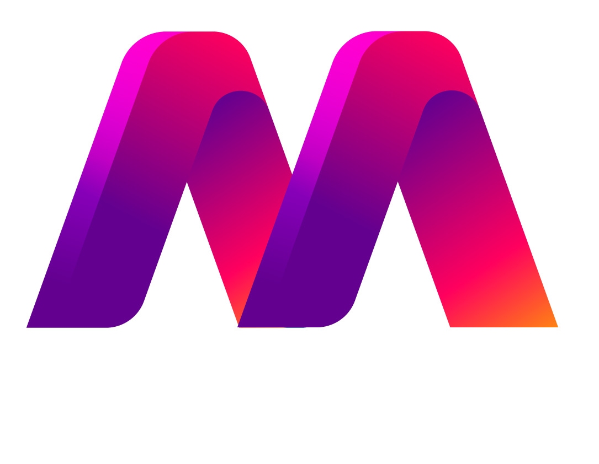

<a name="readme-top"></a>

<div align="center">

  
  <br/>

  <h3><b>MovieMax App</b></h3>

</div>

# 📗 Table of Contents

- [📗 Table of Contents](#-table-of-contents)
- [📖 Javascript Capstone Project (Movie App) ](#-javascript-capstone-project-movie-app-)
  - [👌 Kanban Template ](#-kanban-template-)
  - [🎉 Zoom Video](#-zoom-video)
  - [🛠 Built With HTML, CSS, \& Javascript](#-built-with-html-css--javascript)
    - [Tech Stack ](#tech-stack-)
    - [Key Features ](#key-features-)
  - [🚀 Live Demo ](#-live-demo-)
  - [💻 Getting Started ](#-getting-started-)
    - [Prerequisites](#prerequisites)
    - [Clone](#clone)
    - [Install](#install)
    - [Usage](#usage)
  - [👥 Authors ](#-authors-)
  - [🔭 Future Features ](#-future-features-)
  - [🙏 Acknowledgments ](#-acknowledgments-)
  - [🤝 Contributing ](#-contributing-)
  - [⭐️ Show your support ](#️-show-your-support-)
  - [📝 License ](#-license-)

# 📖 Javascript Capstone Project (Movie App) <a name="MovieMax"></a>

> Js Capstone Project - This is a MovieMax app that sends and receives data from an API and populates data on the browser. It also allows you to add comments or likes to a movie. The app has implemented ES6 modules, callbacks, and promises, webpack, used AAA pattern for unit tests, and gitflow.

## 👌 Kanban Template <a name="kanban">

- Our Kanban template can be found [here.](https://github.com/felixDev22/Kanban---Movie-Project/projects/1)
  
## 🎉 Zoom Video
- Our zoom video can be found [here.](https://drive.google.com/file/d/1E5l31oDKbgt5h0u7mVLxsu7HqJCZAkrv/view?usp=share_link)
  
  <p align="right">(<a href="#readme-top">back to top</a>)</p>

## 🛠 Built With <a name="built-with">HTML, CSS, & Javascript</a>

- It has implemented Js Dynamic function to take data

### Tech Stack <a name="tech-stack"></a>

<details>
  <summary>Client</summary>
  <ul>
    <li><a href="#">HTML</a></li>
    <li><a href="#">CSS</a></li>
    <li><a href="#">JavaScript</a></li>
  </ul>
</details>

### Key Features <a name="key-features"></a>

- Clean and interactive
- Adding new comments
- Adding new likes

<p align="right">(<a href="#readme-top">back to top</a>)</p>

## 🚀 Live Demo <a name="live-demo"></a>

- [Live Demo Link](https://leehaney254.github.io/Movies-App/)

## 💻 Getting Started <a name="getting-started"></a>

To get a local copy up and running, follow these steps.

- Create a local directory where you can clone the project.
- Clone the project into your repository
- Install the dependencies
- Open the project on a browser

### Prerequisites

In order to run this project you need:

- Git and GitHub
- A code editor
- Nodejs
- A browser

### Clone

Clone this repository to your desired folder:

```sh
  mkdir my-game
  cd my-game
  git clone https://leehaney254.github/Movies-App
```

### Install

Run npm install to install all dependencies required to run the project.

```sh
  cd Movies-App
  npm install
```

### Usage

To run the project, execute the following command:

```sh
 npm start
 This starts the development server on port: 8080
```

<p align="right">(<a href="#readme-top">back to top</a>)</p>

## 👥 Authors <a name="authors"></a>

👤 Felix Nyamai

- GitHub: [felixDev22](https://github.com/felixDev22)
- Twitter: [@monzo200](https://twitter.com/monzo200)
- LinkedIn: [LinkedIn](https://www.linkedin.com/in/felixnyamai/)

👤 Leehaney George

- GitHub: [leehaney254](https://github.com/leehaney254)
- Twitter: [@Lee06785586](https://twitter.com/twitterhandle)
- LinkedIn: [LinkedIn](https://www.linkedin.com/in/leehaney-george)

<p align="right">(<a href="#readme-top">back to top</a>)</p>

<!-- FUTURE FEATURES -->

## 🔭 Future Features <a name="future-features"></a>


- [ ] **Improve the UI**
- [ ] **Make it mobile friendly**

<p align="right">(<a href="#readme-top">back to top</a>)</p>

## 🙏 Acknowledgments <a name="acknowledgements"></a>

Microverse learning experience

<p align="right">(<a href="#readme-top">back to top</a>)</p>

## 🤝 Contributing <a name="contributing"></a>

Contributions, issues, and feature requests are welcome!

Feel free to check the [issues page](https://github.com/leehaney254/Movies-App/issues).

<p align="right">(<a href="#readme-top">back to top</a>)</p>

## ⭐️ Show your support <a name="support"></a>

If you like this project please give a star...

<p align="right">(<a href="#readme-top">back to top</a>)</p>

## 📝 License <a name="license"></a>

This project is [MIT](./LICENSE) licensed.

<p align="right">(<a href="#readme-top">back to top</a>)</p>
